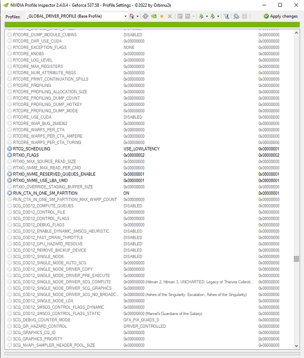

 **NVIDIA Profile Inspector**

This is a custom Version with full named Settings, used for modifying game profiles inside the internal driver database of the nvidia driver.
All game profiles are provided by the nvidia driver, but you can add your own profiles for games missing in the driver database.

For more usefull information:
* [https://wiki.step-project.com/Guide:NVIDIA_Inspector](https://github.com/NVIDIA/open-gpu-kernel-modules/tree/main)
* https://www.pcgamingwiki.com/wiki/Nvidia_Profile_Inspector

